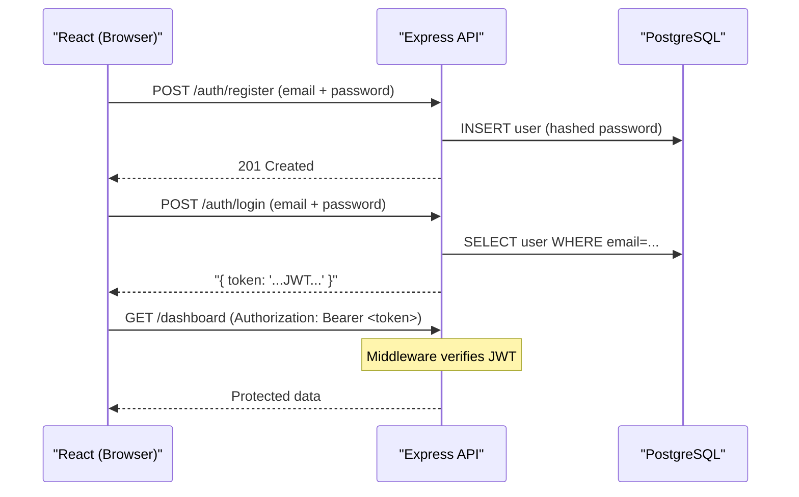
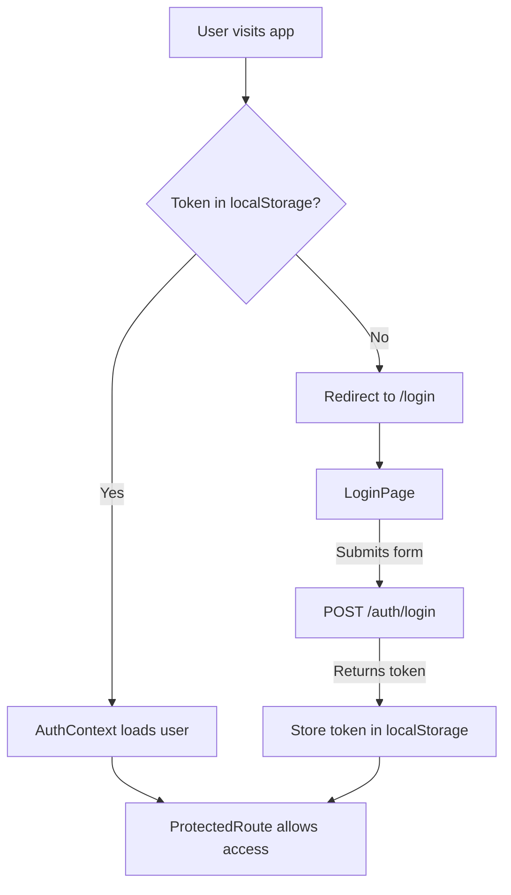

# Dashboard Auth Setup

## How the whole thing works




**Key concepts:**

- **JWT (JSON Web Token)** - a signed string the server gives you after login. You attach it to every future request to prove you are who you say you are. The server does not store it; it just verifies the signature.
- **bcrypt** - a hashing algorithm. Passwords are never stored in plain text. bcrypt scrambles them in a one-way fashion so even if the database leaks, passwords are safe.
- **Prisma** - an ORM (Object Relational Mapper). Instead of writing raw SQL like `SELECT * FROM users WHERE ...`, you write JavaScript/TypeScript. Prisma also generates a `schema.prisma` file that is the single source of truth for your database structure.
- **Protected route (React)** - a component that checks if a JWT is stored in the browser. If yes, it renders the page. If no, it redirects to `/login`.

---

## Step 1 - Backend (`dashboard-node`)

### 1a. Install packages

- `prisma` + `@prisma/client` - database ORM
- `bcrypt` - password hashing
- `jsonwebtoken` - create and verify JWTs
- `cors` - allow the React app (different port) to call the API
- `dotenv` - load secrets from a `.env` file

### 1b. File structure after this step

```
dashboard-node/
  prisma/
    schema.prisma       ← defines the User table
  src/
    middleware/
      auth.js           ← verifies JWT on protected routes
    routes/
      auth.js           ← POST /auth/register, POST /auth/login
    routes/
      dashboard.js      ← GET /dashboard (protected example)
  index.js              ← updated to wire everything together
  .env                  ← DATABASE_URL + JWT_SECRET (never commit this)
```

### 1c. Prisma schema (`prisma/schema.prisma`)

```prisma
model User {
  id        Int      @id @default(autoincrement())
  email     String   @unique
  password  String
  createdAt DateTime @default(now())
}
```

### 1d. Auth routes logic

- `POST /auth/register` → hash password with bcrypt → insert User → return 201
- `POST /auth/login` → find User by email → compare password with bcrypt → if match, sign a JWT and return it

### 1e. JWT middleware (`src/middleware/auth.js`)

Reads the `Authorization: Bearer <token>` header, verifies the JWT signature. If valid, attaches the user info to `req.user` and calls `next()`. If invalid, returns 401 Unauthorized.

---

## Step 2 - Frontend (`dashboard`)

### 2a. Install packages

- `react-router-dom` - client-side routing (navigate between pages without full page reload)
- No extra fetch library needed; we will use the built-in `fetch` API

### 2b. File structure after this step

```
dashboard/src/
  context/
    AuthContext.tsx     ← stores the JWT + current user, shares it app-wide
  components/
    ProtectedRoute.tsx  ← redirects to /login if no token
  pages/
    LoginPage.tsx
    RegisterPage.tsx
    DashboardPage.tsx
  App.tsx               ← updated with routes
```

### 2c. How JWT is stored in the browser

The token is saved to `localStorage`. When the page refreshes, the app reads it back so the user stays logged in.

> Note: for a production app you would eventually use an httpOnly cookie instead (more secure), but localStorage is simpler to learn with first.

### 2d. Auth flow in React




---

## Step 3 - CORS setup

The React dev server runs on port `5173`, the API on port `3000`. Browsers block cross-origin requests by default. We will configure the `cors` middleware in Express to allow `http://localhost:5173`.

---

## What you will need before we start

1. **PostgreSQL running locally** - if you do not have it installed, the easiest way on Windows is [PostgreSQL installer](https://www.postgresql.org/download/windows/) or Docker (`docker run --name pg -e POSTGRES_PASSWORD=secret -p 5432:5432 -d postgres`).
2. A database name (e.g. `dashboard_db`) and your PostgreSQL password.

